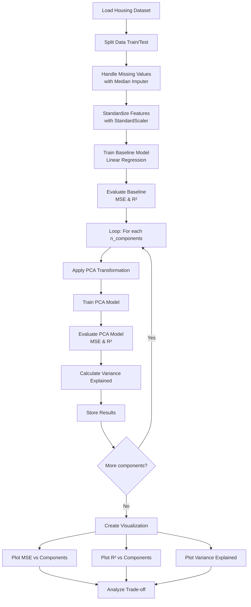

# PCA Dimensionality Reduction on Boston Housing Dataset

## Objective

Apply Principal Component Analysis (PCA) algorithm for dimensionality reduction on the Boston Housing dataset and observe the influence of feature reduction on model performance and computational efficiency.

## Dataset

The **Boston Housing Dataset** is a well-known open-access dataset containing 506 samples with 13 features used to predict median house prices (MEDV). Features include:

- CRIM - Per capita crime rate by town
- ZN - Proportion of residential land zoned for lots over 25,000 sq.ft.
- INDUS - Proportion of non-retail business acres per town
- CHAS - Charles River dummy variable
- NOX - Nitric oxides concentration (parts per 10 million)
- RM - Average number of rooms per dwelling
- AGE - Proportion of owner-occupied units built prior to 1940
- DIS - Weighted distances to five Boston employment centers
- RAD - Index of accessibility to radial highways
- TAX - Full-value property-tax rate per 10,000
- PTRATIO - Pupil-teacher ratio by town
- B - 1000(Bk - 0.63)^2 where Bk is the proportion of blacks by town
- LSTAT - Percentage of lower status of the population

**Target Variable:** MEDV - Median value of owner-occupied homes in $1000s

## Theory

### Principal Component Analysis (PCA)

PCA is an unsupervised dimensionality reduction technique that transforms a set of correlated variables into a set of uncorrelated variables called **principal components**. These components are ordered such that the first few retain most of the variation present in the original dataset.

**Key Concepts:**

1. **Variance Explained**: Each principal component captures a portion of the total variance in the data. The first component captures the most variance, with subsequent components capturing decreasing amounts.

2. **Eigenvalue Decomposition**: PCA performs eigenvalue decomposition on the covariance matrix of the features to find principal components (eigenvectors) and their corresponding eigenvalues (variance explained).

3. **Dimensionality Reduction**: By selecting only the top k components that explain sufficient variance (e.g., 95%), we can reduce the feature space while retaining most information.

### Why Use PCA?

- **Reduced Computational Cost**: Fewer features lead to faster training and prediction
- **Noise Reduction**: Components with low variance (noise) can be discarded
- **Multicollinearity Elimination**: Transformed features are uncorrelated
- **Visualization**: High-dimensional data can be visualized in 2D/3D space

### Mathematical Foundation

For a dataset X with n samples and p features:

1. Standardize the features to zero mean and unit variance
2. Compute the covariance matrix: Σ = (1/n) X^T X
3. Calculate eigenvalues and eigenvectors: Σv = λv
4. Sort eigenvectors by descending eigenvalues
5. Select top k eigenvectors as principal components
6. Transform data: X_pca = X · W (where W is the projection matrix)

## Project Structure

```
Assignment1/
├── Assignment_1.ipynb      # Main Jupyter notebook with PCA analysis
├── HousingData.csv         # Boston Housing dataset
├── visualization.py        # Visualization functions for PCA results
├── output.png              # Generated visualization output
└── README.md               # This documentation file
```

## Program Flow



## Analysis Steps

1. **Data Loading and Preprocessing**
   - Load Boston Housing dataset
   - Split into training and test sets (80/20)
   - Handle missing values using median imputation
   - Standardize features to have zero mean and unit variance

2. **Baseline Model Training**
   - Train a Linear Regression model on all 13 features
   - Evaluate performance using MSE and R² score

3. **PCA Experimentation**
   - Apply PCA with varying number of components (1 to 13)
   - Train Linear Regression on transformed features
   - Record MSE, R², and variance explained for each configuration

4. **Visualization and Interpretation**
   - Plot model performance against number of components
   - Plot cumulative variance explained
   - Identify optimal number of components balancing performance and dimensionality

## Key Observations

The analysis demonstrates:

- How model performance (MSE/R²) changes with reduced dimensions
- The trade-off between feature reduction and information retention
- Whether a lower-dimensional representation maintains comparable predictive power

## Usage

```bash
# Install required packages
pip install pandas numpy scikit-learn matplotlib

# Run the Jupyter notebook
jupyter notebook Assignment_1.ipynb
```

## Dependencies

- pandas
- numpy
- scikit-learn
- matplotlib