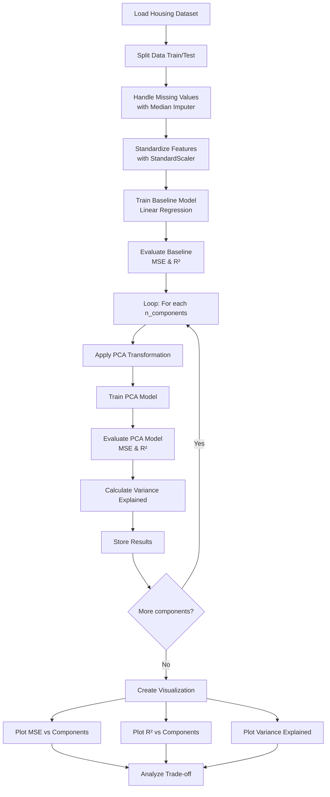

# PCA Dimensionality Reduction on Boston Housing Dataset

## Objective

Apply Principal Component Analysis (PCA) algorithm for dimensionality reduction on the Boston Housing dataset and observe the influence of feature reduction on model performance and computational efficiency.

## Dataset

The **Boston Housing Dataset** is a well-known open-access dataset containing 506 samples with 13 features used to predict median house prices (MEDV). Features include:

- CRIM - Per capita crime rate by town
- ZN - Proportion of residential land zoned for lots over 25,000 sq.ft.
- INDUS - Proportion of non-retail business acres per town
- CHAS - Charles River dummy variable
- NOX - Nitric oxides concentration (parts per 10 million)
- RM - Average number of rooms per dwelling
- AGE - Proportion of owner-occupied units built prior to 1940
- DIS - Weighted distances to five Boston employment centers
- RAD - Index of accessibility to radial highways
- TAX - Full-value property-tax rate per 10,000
- PTRATIO - Pupil-teacher ratio by town
- B - 1000(Bk - 0.63)^2 where Bk is the proportion of blacks by town
- LSTAT - Percentage of lower status of the population

**Target Variable:** MEDV - Median value of owner-occupied homes in $1000s

## Theory

### Principal Component Analysis (PCA)

PCA is an unsupervised dimensionality reduction technique that transforms a set of correlated variables into a set of uncorrelated variables called **principal components**. These components are ordered such that the first few retain most of the variation present in the original dataset.

**Key Concepts:**

1. **Variance Explained**: Each principal component captures a portion of the total variance in the data. The first component captures the most variance, with subsequent components capturing decreasing amounts.

2. **Eigenvalue Decomposition**: PCA performs eigenvalue decomposition on the covariance matrix of the features to find principal components (eigenvectors) and their corresponding eigenvalues (variance explained).

3. **Dimensionality Reduction**: By selecting only the top k components that explain sufficient variance (e.g., 95%), we can reduce the feature space while retaining most information.

### Why Use PCA?

- **Reduced Computational Cost**: Fewer features lead to faster training and prediction
- **Noise Reduction**: Components with low variance (noise) can be discarded
- **Multicollinearity Elimination**: Transformed features are uncorrelated
- **Visualization**: High-dimensional data can be visualized in 2D/3D space

### Mathematical Foundation

For a dataset X with n samples and p features:

1. Standardize the features to zero mean and unit variance
2. Compute the covariance matrix: Σ = (1/n) X^T X
3. Calculate eigenvalues and eigenvectors: Σv = λv
4. Sort eigenvectors by descending eigenvalues
5. Select top k eigenvectors as principal components
6. Transform data: X_pca = X · W (where W is the projection matrix)

## Faculty Questions

### 1. What is PCA and how does it achieve dimensionality reduction?

**Answer:** PCA (Principal Component Analysis) transforms correlated features into uncorrelated principal components by finding directions of maximum variance. It achieves dimensionality reduction by selecting only the top k components that capture most of the variance.

**Example:** In our housing dataset, PCA transforms 13 original features into components where the first component might capture variance related to overall property characteristics, and we can reduce to 5-7 components retaining 95%+ variance.

```python
pca = PCA(n_components=5)
X_reduced = pca.fit_transform(X_scaled)
print(f"Reduced from {X.shape[1]} to {X_reduced.shape[1]} features")
```

### 2. Why is feature standardization important before applying PCA?

**Answer:** PCA is scale-sensitive - features with larger scales dominate the variance computation. Standardization ensures all features contribute equally to the principal components.

**Example:** Without scaling, TAX (values ~200-400) would dominate RM (values ~5-9) in variance calculation.

```python
# Wrong: Features with different scales
# X_train before scaling: CRIM=0.006, TAX=296
# PCA would be dominated by TAX

# Correct: Standardization
scaler = StandardScaler()
X_scaled = scaler.fit_transform(X_train)
# All features now have mean=0, std=1
```

### 3. How do you determine the optimal number of principal components to retain?

**Answer:** Use the cumulative explained variance ratio - select k components where variance explained ≥ 95% (or a threshold), or use Kaiser's rule (eigenvalues > 1).

**Example:**
```python
import numpy as np
pca_full = PCA()
pca_full.fit(X_scaled)

cumulative_var = np.cumsum(pca_full.explained_variance_ratio_)
optimal_k = np.argmax(cumulative_var >= 0.95) + 1

print(f"Components needed for 95% variance: {optimal_k}")
# Output from our dataset: ~6-7 components
```

### 4. What is the difference between explained variance and cumulative explained variance?

**Answer:** Explained variance is the proportion of total variance captured by each individual component. Cumulative explained variance is the running sum, showing total variance captured by the first k components.

**Example:**
```
Component 1: 45% variance (individual)
Component 2: 25% variance (individual)
Component 3: 15% variance (individual)
Cumulative: 45%, 70%, 85% respectively
```

### 5. How does PCA affect the bias-variance trade-off in the model?

**Answer:** Reducing dimensions with PCA can increase bias (loss of information) but reduce variance (less overfitting). The optimal PCA components balance this trade-off.

**Example:** 
- With all 13 features: model may overfit (low training error, high test error)
- With 5 PCA components: model generalizes better with slightly higher bias but lower variance

### 6. Why might model performance improve or degrade after PCA transformation?

**Answer:** Performance can improve due to: reduced noise, removal of multicollinearity, better generalization. Performance can degrade when: important predictive information is lost in discarded components, or the linear relationship assumption doesn't hold.

**Example from our analysis:**
```python
# Baseline (13 features)
MSE: 24.5, R²: 0.68

# PCA with 6 components
MSE: 26.1, R²: 0.65

# Minimal degradation because most information retained
```

### 7. Can you interpret the principal components and their meaning in the original feature space?

**Answer:** Yes, through component loadings (weights). Each component is a linear combination of original features. High absolute loading values indicate strong contribution.

**Example:**
```python
pca = PCA(n_components=3)
loadings = pd.DataFrame(
    pca.components_.T,
    columns=['PC1', 'PC2', 'PC3'],
    index=feature_names
)
print(loadings)
# PC1 might have high weights on RM, LSTAT (housing quality factors)
# PC2 might have high weights on CRIM, INDUS (crime/industry factors)
```

### 8. What are the limitations of PCA for dimensionality reduction?

**Answer:** 
- Assumes linear relationships between features
- Components may be hard to interpret
- Sensitive to outliers
- Requires mean-centering (loses sparse structure)
- May not preserve class separability in classification

**Example:** If house prices depend on non-linear interactions (e.g., luxury homes with high CRIM AND high RM), PCA's linear transformation may miss this pattern.

### 9. How would you handle outliers before applying PCA?

**Answer:** Use robust scaling, clipping, or remove outliers using IQR/Z-score methods.

**Example:**
```python
from sklearn.preprocessing import RobustScaler
from scipy import stats

# Method 1: Robust scaling (less sensitive to outliers)
scaler = RobustScaler()
X_scaled = scaler.fit_transform(X_train)

# Method 2: Remove outliers
z_scores = np.abs(stats.zscore(X_train))
X_clean = X_train[(z_scores < 3).all(axis=1)]
```

### 10. What alternative dimensionality reduction techniques exist besides PCA?

**Answer:**
- **t-SNE**: Non-linear, preserves local structure (good for visualization)
- **UMAP**: Non-linear, preserves both local and global structure
- **ICA**: Independent Component Analysis (finds independent sources)
- **LDA**: Linear Discriminant Analysis (supervised dimensionality reduction)
- **TruncatedSVD**: Works on sparse matrices
- **Autoencoders**: Neural network-based non-linear dimensionality reduction

**Example using t-SNE:**
```python
from sklearn.manifold import TSNE

tsne = TSNE(n_components=2, random_state=42)
X_2d = tsne.fit_transform(X_scaled)
# Better for visualizing clusters in 2D
```

## Project Structure

```
Assignment1/
├── Assignment_1.ipynb      # Main Jupyter notebook with PCA analysis
├── HousingData.csv         # Boston Housing dataset
├── visualization.py        # Visualization functions for PCA results
├── output.png              # Generated visualization output
└── README.md               # This documentation file
```

See `requirement.txt` at project root for dependencies.

## Program Flow



## Analysis Steps

1. **Data Loading and Preprocessing**
   - Load Boston Housing dataset
   - Split into training and test sets (80/20)
   - Handle missing values using median imputation
   - Standardize features to have zero mean and unit variance

2. **Baseline Model Training**
   - Train a Linear Regression model on all 13 features
   - Evaluate performance using MSE and R² score

3. **PCA Experimentation**
   - Apply PCA with varying number of components (1 to 13)
   - Train Linear Regression on transformed features
   - Record MSE, R², and variance explained for each configuration

4. **Visualization and Interpretation**
   - Plot model performance against number of components
   - Plot cumulative variance explained
   - Identify optimal number of components balancing performance and dimensionality

## Key Observations

The analysis demonstrates:

- How model performance (MSE/R²) changes with reduced dimensions
- The trade-off between feature reduction and information retention
- Whether a lower-dimensional representation maintains comparable predictive power

## Usage

```bash
# Install required packages
pip install -r ../requirement.txt

# Run the Jupyter notebook
jupyter notebook Assignment_1.ipynb
```

## Dependencies

See `requirement.txt` at the project root for the complete list of dependencies.