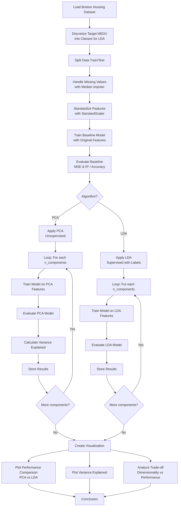

# Feature Transformation: LDA vs PCA on Boston Housing Dataset

## Objective

Apply **Linear Discriminant Analysis (LDA)** for dimensionality reduction on the Boston Housing dataset (the same open-access high-dimensional dataset used in Assignment 1) and observe its performance and computational efficiency in comparison with the **Principal Component Analysis (PCA)** algorithm.

## Dataset

The **Boston Housing Dataset** is a well-known open-access dataset containing 506 samples with 13 features used to predict median house prices (MEDV). Features include:

- CRIM - Per capita crime rate by town
- ZN - Proportion of residential land zoned for lots over 25,000 sq.ft.
- INDUS - Proportion of non-retail business acres per town
- CHAS - Charles River dummy variable
- NOX - Nitric oxides concentration (parts per 10 million)
- RM - Average number of rooms per dwelling
- AGE - Proportion of owner-occupied units built prior to 1940
- DIS - Weighted distances to five Boston employment centers
- RAD - Index of accessibility to radial highways
- TAX - Full-value property-tax rate per 10,000
- PTRATIO - Pupil-teacher ratio by town
- B - 1000(Bk - 0.63)^2 where Bk is the proportion of blacks by town
- LSTAT - Percentage of lower status of the population

**Target Variable:** MEDV - Median value of owner-occupied homes in $1000s

## Theory

### Principal Component Analysis (PCA) - Recap

PCA is an **unsupervised** dimensionality reduction technique that transforms a set of correlated variables into a set of uncorrelated variables called **principal components**. These components are ordered such that the first few retain most of the variation present in the original dataset.

**Key Concepts:**

1. **Variance Explained**: Each principal component captures a portion of the total variance in the data. The first component captures the most variance, with subsequent components capturing decreasing amounts.
2. **Eigenvalue Decomposition**: PCA performs eigenvalue decomposition on the covariance matrix of the features to find principal components (eigenvectors) and their corresponding eigenvalues (variance explained).
3. **Dimensionality Reduction**: By selecting only the top k components that explain sufficient variance (e.g., 95%), we can reduce the feature space while retaining most information.

**Mathematical Foundation:**

For a dataset X with n samples and p features:

1. Standardize the features to zero mean and unit variance
2. Compute the covariance matrix: $\Sigma = \frac{1}{n} X^{\top}X$
3. Calculate eigenvalues and eigenvectors: $\Sigma v = \lambda v$
4. Sort eigenvectors by descending eigenvalues
5. Select top k eigenvectors as principal components
6. Transform data: $X_{\text{PCA}} = XW$ (where W is the projection matrix)

### Linear Discriminant Analysis (LDA)

LDA is a **supervised** dimensionality reduction technique that seeks to find a feature subspace that maximizes class separability. Unlike PCA which maximizes variance, LDA maximizes the ratio of **between-class variance** to **within-class variance**.

**Key Concepts:**

1. **Class Separability**: LDA finds axes that best separate different classes by maximizing the distance between class means while minimizing the spread within each class.
2. **Scatter Matrices**: LDA uses two types of scatter matrices:

   - **Within-class scatter matrix ($S_W$)**: Measures spread of samples around their own class mean
   - **Between-class scatter matrix ($S_B$)**: Measures spread between different class means
3. **Objective Function**: LDA maximizes the ratio $J(W) = \frac{|W^T S_B W|}{|W^T S_W W|}$
4. **Maximum Components**: For a classification problem with C classes, LDA can produce at most $C-1$ discriminant components.

**Mathematical Foundation:**

For a dataset with classes $c_1, c_2, ..., c_C$:

1. Compute the mean vector for each class: $\mu_c = \frac{1}{n_c} \sum_{x \in c} x$
2. Compute within-class scatter matrix:
   $S_W = \sum_{c=1}^{C} \sum_{x \in c} (x - \mu_c)(x - \mu_c)^T$
3. Compute between-class scatter matrix:
   $S_B = \sum_{c=1}^{C} n_c (\mu_c - \mu)(\mu_c - \mu)^T$
4. Solve the generalized eigenvalue problem for $S_W^{-1} S_B$
5. Select top k eigenvectors as linear discriminants

### PCA vs LDA: Key Differences

| Aspect                     | PCA                                       | LDA                            |
| -------------------------- | ----------------------------------------- | ------------------------------ |
| **Supervision**      | Unsupervised (ignores labels)             | Supervised (uses labels)       |
| **Objective**        | Maximize variance                         | Maximize class separability    |
| **Components**       | At most min(n_samples, n_features)        | At most (n_classes - 1)        |
| **Assumption**       | Data has Gaussian-like variance structure | Classes are linearly separable |
| **Best For**         | General dimensionality reduction          | Classification tasks           |
| **Sensitivity**      | Sensitive to feature scaling              | Sensitive to feature scaling   |
| **Data Requirement** | Works with any continuous data            | Requires class labels          |

### Why Use Dimensionality Reduction?

- **Reduced Computational Cost**: Fewer features lead to faster training and prediction
- **Noise Reduction**: Low-variance components (noise) can be discarded
- **Multicollinearity Elimination**: Transformed features are uncorrelated
- **Visualization**: High-dimensional data can be visualized in 2D/3D space
- **Curse of Dimensionality**: Reduces risk of overfitting in high-dimensional spaces

## Faculty Questions - Top 10 Most Likely Questions

### 1. What is LDA and how does it differ from PCA for dimensionality reduction?

**Answer:** LDA (Linear Discriminant Analysis) is a supervised dimensionality reduction technique that finds axes that maximize class separability by maximizing the ratio of between-class variance to within-class variance.

**Key differences from PCA:**

- PCA is unsupervised and ignores class labels; LDA uses class labels to find discriminative directions
- PCA maximizes total variance; LDA maximizes class separability
- PCA components are orthogonal; LDA components are not necessarily orthogonal
- LDA is limited to (C-1) components where C is the number of classes; PCA can produce up to min(n_samples, n_features) components

**Example:** In the Boston Housing dataset (which is a regression task), if we discretize MEDV into price brackets (Low, Medium, High), LDA would find components that best separate these price categories, while PCA would find components that explain maximum variance regardless of price categories.

```python
# PCA: Unsupervised
pca = PCA(n_components=5)
X_pca = pca.fit_transform(X_scaled)  # No y used

# LDA: Supervised  
lda = LinearDiscriminantAnalysis(n_components=1)
X_lda = lda.fit_transform(X_scaled, y_discrete)  # y_discrete required
```

### 2. What are the scatter matrices in LDA and what do they represent?

**Answer:** LDA uses two scatter matrices:

- **Within-class scatter matrix ($S_W$)**: Represents the scatter of samples around their own class mean. It measures how spread out the samples are within each class. A small $S_W$ means samples in each class are tightly clustered.
- **Between-class scatter matrix ($S_B$)**: Represents the scatter of class means around the overall mean. It measures how far apart different class means are. A large $S_B$ means class means are well-separated.

LDA maximizes the ratio $\frac{|W^T S_B W|}{|W^T S_W W|}$, finding directions where between-class scatter is large relative to within-class scatter.

```python
from sklearn.discriminant_analysis import LinearDiscriminantAnalysis

lda = LinearDiscriminantAnalysis()
lda.fit(X_train, y_train_discrete)

# Within-class scatter (conceptual)
S_W = sum([np.cov(X_train[y_train_discrete == c].T) * 
           np.sum(y_train_discrete == c) 
           for c in classes])

# Between-class scatter (conceptual)  
S_B = np.cov(means.T) * len(classes)
```

### 3. Why is feature standardization important for LDA?

**Answer:** LDA is scale-sensitive, similar to PCA. If features have different scales, features with larger ranges will dominate the scatter matrix calculations. Standardization ensures all features contribute equally to the discriminant directions.

**Example:** In the Boston Housing dataset, TAX has values in the hundreds while RM has values around 5-9. Without scaling, TAX would disproportionately influence the within-class and between-class scatter matrices.

```python
from sklearn.preprocessing import StandardScaler

scaler = StandardScaler()
X_train_scaled = scaler.fit_transform(X_train)
X_test_scaled = scaler.transform(X_test)

# Now all features have mean=0, std=1
# LDA can weight each feature fairly
```

### 4. What is the maximum number of components LDA can produce?

**Answer:** LDA can produce at most $(C - 1)$ components, where $C$ is the number of classes. This is because the between-class scatter matrix $S_B$ has at most rank $(C-1)$.

**Example:**

- Binary classification (2 classes): Maximum 1 component
- Multi-class with 3 classes (Low, Medium, High price): Maximum 2 components
- Multi-class with 4 classes: Maximum 3 components

```python
from sklearn.discriminant_analysis import LinearDiscriminantAnalysis

# For 3 classes (e.g., Low, Medium, High MEDV)
lda = LinearDiscriminantAnalysis(n_components=2)  # Max possible: 3-1=2
X_lda = lda.fit_transform(X_scaled, y_discrete)

print(f"Original features: {X.shape[1]}")
print(f"LDA components: {X_lda.shape[1]}")  # Will be at most 2
```

### 5. How does LDA handle the bias-variance trade-off?

**Answer:** LDA reduces variance by projecting data onto a lower-dimensional space that maximizes class separability. However, since LDA uses class labels, it can:

- **Reduce bias**: By focusing on directions that separate classes, it preserves discriminative information
- **Reduce variance**: By reducing dimensionality, it reduces model complexity
- **Risk of overfitting**: With very few samples per class, LDA may overfit

The trade-off depends on the number of components selected and the class separability in the original feature space.

```python
# More components: Lower bias, higher variance
lda_full = LinearDiscriminantAnalysis(n_components=2)
X_train_lda_full = lda_full.fit_transform(X_train_scaled, y_discrete)

# Fewer components: Higher bias, lower variance
lda_reduced = LinearDiscriminantAnalysis(n_components=1)
X_train_lda_reduced = lda_reduced.fit_transform(X_train_scaled, y_discrete)
```

### 6. Can LDA be used for regression tasks like predicting Boston Housing prices?

**Answer:** Strictly speaking, LDA is designed for **classification** tasks with discrete class labels. For regression tasks like predicting continuous MEDV values, LDA is not directly applicable.

However, LDA can be applied in two ways:

1. **Discretize the target**: Convert continuous MEDV into discrete categories (e.g., Low: <20, Medium: 20-30, High: >30)
2. **Use for visualization**: Apply LDA on binned categories to visualize class separability

For pure regression, **Linear Discriminant Regression** or supervised PCA variants are more appropriate, or simply use LDA as an exploratory tool after discretization.

```python
# Discretize continuous target into classes
y_bins = pd.cut(y, bins=3, labels=['Low', 'Medium', 'High'])

# Now LDA can be applied
from sklearn.discriminant_analysis import LinearDiscriminantAnalysis
lda = LinearDiscriminantAnalysis()
X_lda = lda.fit_transform(X_scaled, y_bins)
```

### 7. What assumptions does LDA make about the data?

**Answer:** LDA makes several key assumptions:

1. **Normality**: Features in each class are normally distributed (Gaussian)
2. **Homoscedasticity**: All classes share the same covariance matrix
3. **Linear Decision Boundaries**: Class boundaries are linear in the feature space
4. **No Multicollinearity**: Features are not highly correlated (or if they are, PCA may be applied first)
5. **Large Sample Size**: LDA estimates covariance matrices, requiring sufficient samples per class

**Violation Example:** If Low-price homes have much larger variance in CRIM than High-price homes, the homoscedasticity assumption is violated, and LDA performance will degrade.

```python
# Checking assumptions
import scipy.stats as stats

# Test for normality in each class
for c in classes:
    data_c = X[y == c]
    stat, p = stats.shapiro(data_c)
    if p < 0.05:
        print(f"Class {c} may not be normally distributed")
```

### 8. How do you choose between PCA and LDA for a given dataset?

**Answer:** Choose based on task type and goals:

| Scenario                                    | Recommended Approach    |
| ------------------------------------------- | ----------------------- |
| **No class labels / Unsupervised**    | PCA                     |
| **Classification with clear classes** | LDA                     |
| **Regression task**                   | PCA                     |
| **Maximize variance retention**       | PCA                     |
| **Maximize class separability**       | LDA                     |
| **More components needed**            | PCA                     |
| **Few classes, linear boundaries**    | LDA                     |
| **Non-linear boundaries**             | t-SNE or kernel methods |

**Example Decision Flow:**

- Boston Housing (regression): Use PCA
- Iris dataset (classification): LDA often outperforms PCA
- Text data (unsupervised): PCA or TruncatedSVD

```python
if task_type == 'classification' and n_classes > 2:
    # LDA is likely better for dimensionality reduction
    reducer = LinearDiscriminantAnalysis()
elif task_type == 'regression':
    # PCA or supervised alternatives
    reducer = PCA()
else:
    # Unsupervised or unknown
    reducer = PCA()
```

### 9. What happens when LDA is applied to data that is not linearly separable?

**Answer:** When classes are not linearly separable, standard LDA may perform poorly because it assumes linear decision boundaries. In such cases:

1. **Use Kernel LDA (KLDA)**: Apply kernel trick to project data into higher-dimensional space where classes become linearly separable
2. **Apply non-linear methods**: Use t-SNE or UMAP for dimensionality reduction
3. **Combine with PCA**: First apply PCA to reduce noise, then apply LDA
4. **Discretize carefully**: If using discretized regression targets, ensure classes are meaningful and separable

**Example:** If Low, Medium, and High price categories heavily overlap in feature space, LDA will struggle to find good discriminant components.

```python
# Kernel LDA (conceptual)
from sklearn.discriminant_analysis import LinearDiscriminantAnalysis

# Standard LDA may fail if classes overlap
lda = LinearDiscriminantAnalysis()
X_lda = lda.fit_transform(X_scaled, y_bins)

# If performance is poor, consider:
# - Kernel LDA (requires custom implementation)
# - PCA for dimensionality reduction first
# - Different class discretization strategy
```

### 10. How does computational efficiency of LDA compare to PCA?

**Answer:** Both LDA and PCA have similar computational complexity for the core decomposition:

- **PCA**: $O(p^2 n + p^3)$ for eigenvalue decomposition of the $p \times p$ covariance matrix
- **LDA**: $O(p^2 n + p^3)$ for eigenvalue decomposition of $S_W^{-1} S_B$

**However**, there are practical differences:

| Factor                     | PCA                                 | LDA                                                        |
| -------------------------- | ----------------------------------- | ---------------------------------------------------------- |
| **Matrix Size**      | $p \times p$ covariance matrix    | $p \times p$ scatter matrices                            |
| **Components**       | Up to$p$                          | Limited to$C-1$ (usually much smaller)                   |
| **Memory**           | Stores$p$ eigenvectors            | Stores only$C-1$ eigenvectors                            |
| **Prediction Speed** | $O(kp)$ where $k$ is components | $O(kp)$ where $k$ is components (but $k$ is smaller) |

**Example:** For the Boston Housing dataset with 13 features:

- PCA can produce up to 13 components
- LDA (if we use 3 price classes) can produce only 2 components
- LDA projection is faster in practice because fewer components are typically retained

```python
import time
from sklearn.decomposition import PCA
from sklearn.discriminant_analysis import LinearDiscriminantAnalysis

# Timing PCA
start = time.time()
pca = PCA(n_components=5)
X_pca = pca.fit_transform(X_scaled)
pca_time = time.time() - start

# Timing LDA  
start = time.time()
lda = LinearDiscriminantAnalysis(n_components=2)
X_lda = lda.fit_transform(X_scaled, y_bins)
lda_time = time.time() - start

print(f"PCA time: {pca_time:.4f}s")
print(f"LDA time: {lda_time:.4f}s")
```

## Project Structure

```
Assignment2/
├── Assignment_2.ipynb      # Main Jupyter notebook with LDA analysis
├── README.md               # This documentation file
```

See `requirement.txt` at project root for dependencies.

## Program Flow



## Analysis Steps

1. **Data Loading and Preprocessing**

   - Load Boston Housing dataset
   - Discretize target variable MEDV into classes for LDA
   - Split into training and test sets (80/20)
   - Handle missing values using median imputation
   - Standardize features to have zero mean and unit variance
2. **Baseline Model Training**

   - Train a baseline model (Linear Regression or Logistic Regression) on all 13 features
   - Evaluate performance using appropriate metrics (MSE, R² for regression; Accuracy for classification)
3. **PCA Experimentation**

   - Apply PCA with varying number of components (1 to 13)
   - Train model on PCA-transformed features
   - Record performance metrics for each configuration
4. **LDA Experimentation**

   - Apply LDA with varying number of components (1 to min(C-1, 13))
   - Train model on LDA-transformed features
   - Record performance metrics for each configuration
5. **Comparison and Visualization**

   - Plot performance metrics (MSE/R² or Accuracy) against number of components for both methods
   - Plot variance explained for PCA
   - Identify optimal number of components for each method
   - Compare computational efficiency (training time)
6. **Interpretation and Conclusion**

   - Analyze the trade-off between dimensionality reduction and performance
   - Discuss when LDA outperforms PCA and vice versa
   - Summarize key findings from the experiment

## Expected Outcomes

- **PCA**: Should retain most variance in fewer components, but may not optimize for class separability
- **LDA**: Should produce components that maximize separation between discretized price categories, potentially achieving better classification performance with fewer components
- **Computational Efficiency**: LDA may be slightly faster when fewer components are retained, but the difference is usually marginal for small datasets like Boston Housing

## Usage

```bash
# Install required packages
pip install -r ../requirement.txt

# Run the Jupyter notebook
jupyter notebook Assignment_2.ipynb
```

## Dependencies

See `requirement.txt` at the project root for the complete list of dependencies.

## References

1. Fisher, R. A. (1936). "The Use of Multiple Measurements in Taxonomic Problems". Annals of Eugenics.
2. Hotelling, H. (1933). "Analysis of a Complex of Statistical Variables into Principal Components". Journal of Educational Psychology.
3. Bishop, C. M. (2006). "Pattern Recognition and Machine Learning". Springer.
4. Scikit-learn Documentation: [LDA](https://scikit-learn.org/stable/modules/generated/sklearn.discriminant_analysis.LinearDiscriminantAnalysis.html), [PCA](https://scikit-learn.org/stable/modules/generated/sklearn.decomposition.PCA.html)
