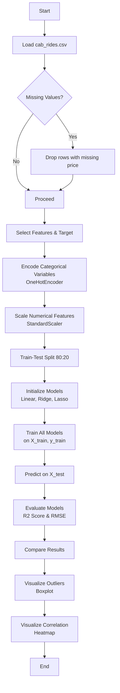

# Assignment 3: Uber and Lyft Cab Prices Prediction Pipeline

## Overview

This assignment implements a complete regression pipeline for predicting cab ride prices using the Uber and Lyft dataset. Three regression models — **Linear Regression**, **Ridge Regression**, and **Lasso Regression** — are trained, compared, and evaluated using R² Score and RMSE.

---

## Theory

### Regression Analysis

Regression is a supervised learning technique used to model the relationship between a dependent variable (target) and one or more independent variables (features). The goal is to predict a continuous numerical output.

### Linear Regression

Linear Regression assumes a linear relationship between the input features and the target variable. The model fits a line (or hyperplane in multiple dimensions) that minimizes the **Sum of Squared Residuals (SSR)** between the predicted and actual values.

**Cost Function (Ordinary Least Squares):**

$$J(\theta) = \frac{1}{2m} \sum_{i=1}^{m} \left( h_\theta(x^{(i)}) - y^{(i)} \right)^2$$

Where:
* $m$ = number of training examples
* $h_\theta(x) = \theta^T x$ (predicted value)
* $y^{(i)}$ = actual value of the $i$-th training example

### Ridge Regression (L2 Regularization)

Ridge Regression adds an **L2 penalty** (sum of squared coefficients) to the cost function to prevent overfitting. This shrinks the coefficient magnitudes toward zero but never exactly to zero.

**Cost Function:**

$$J(\theta) = \frac{1}{2m} \sum_{i=1}^{m} \left( h_\theta(x^{(i)}) - y^{(i)} \right)^2 + \lambda \sum_{j=1}^{n} \theta_j^2$$

Where:
* $\lambda$ (lambda/alpha) controls the regularization strength. Higher $\lambda \rightarrow$ more shrinkage $\rightarrow$ simpler model.
* $n$ = number of features.
* Note: The bias term ($\theta_0$) is typically excluded from the regularization penalty.

### Lasso Regression (L1 Regularization)

Lasso Regression adds an **L1 penalty** (sum of absolute coefficients) to the cost function. This can drive some coefficients exactly to zero, effectively performing **feature selection**.

**Cost Function:**

$$J(\theta) = \frac{1}{2m} \sum_{i=1}^{m} \left( h_\theta(x^{(i)}) - y^{(i)} \right)^2 + \lambda \sum_{j=1}^{n} |\theta_j|$$

Where:
* $\lambda$ (lambda/alpha) controls the regularization strength. Higher $\lambda \rightarrow$ more coefficients driven exactly to zero.
* $n$ = number of features.
* Note: Just like in Ridge Regression, the bias term ($\theta_0$) is typically excluded from the regularization penalty.

### Key Differences

| Aspect | Linear | Ridge (L2) | Lasso (L1) |
|---|---|---|---|
| Penalty | None | Σθⱼ² | Σ|θⱼ| |
| Feature Selection | No | No | Yes |
| Overfitting | Prone | Reduces | Reduces |
| Coefficients | Unrestricted | Shrunk toward 0 | Some exactly 0 |

---

## Flowchart



---

## Dataset

### cab_rides.csv
- **distance**: Ride distance
- **cab_type**: Uber or Lyft
- **source**: Pickup location
- **destination**: Dropoff location
- **name**: Product tier (Shared, Lux, XL, etc.)
- **price**: Target variable (ride fare)
- **surge_multiplier**: Dynamic pricing multiplier
- **time_stamp**: Unix timestamp

### weather.csv
- **temp**: Temperature
- **location**: Weather station location
- **clouds**: Cloud cover
- **pressure**: Atmospheric pressure
- **rain**: Rainfall amount
- **humidity**: Humidity level
- **wind**: Wind speed

---

## How to Run

```bash
python assignment3.py
```

Ensure the following files are in the same directory:
- `cab_rides.csv`
- `weather.csv`
- `assignment3.py`

---

## Output Files

- `outliers_boxplot.png` — Boxplot of ride prices showing outliers
- `correlation_matrix.png` — Heatmap of numerical feature correlations

---

## 10 Most Likely Questions & Answers

### Q1: What is the difference between Linear Regression and Ridge Regression?
**A:** Linear Regression minimizes only the sum of squared residuals. Ridge Regression adds an L2 regularization term (λ * Σθⱼ²) to the cost function, which penalizes large coefficients and reduces overfitting.

### Q2: Why is Lasso Regression useful compared to Linear Regression?
**A:** Lasso Regression uses L1 regularization which can drive some feature coefficients to exactly zero. This performs automatic feature selection, resulting in a simpler and more interpretable model.

### Q3: What is the role of `alpha` (λ) in Ridge and Lasso?
**A:** Alpha controls the strength of regularization. A higher alpha increases the penalty on coefficients, leading to smaller coefficient values and a simpler model. Too high an alpha can cause underfitting.

### Q4: Why is `StandardScaler` used before training regression models?
**A:** StandardScaler standardizes features by removing the mean and scaling to unit variance. This ensures all features contribute equally to the model and is especially important for regularization-based models (Ridge, Lasso) where coefficient magnitudes are penalized.

### Q5: What does the R² Score measure?
**A:** R² Score (coefficient of determination) measures the proportion of variance in the target variable that is explained by the model. It ranges from -∞ to 1, where 1 indicates a perfect fit and 0 indicates the model performs no better than predicting the mean.

### Q6: What does RMSE tell us?
**A:** Root Mean Squared Error (RMSE) measures the average magnitude of prediction errors in the same units as the target variable. Lower RMSE indicates better predictive accuracy. It penalizes larger errors more heavily due to the squaring.

### Q7: How are outliers detected in this assignment?
**A:** Outliers are detected using the **Interquartile Range (IQR)** method. Values below Q1 - 1.5*IQR or above Q3 + 1.5*IQR are flagged as outliers. This is a standard statistical approach for identifying extreme values.

### Q8: Why is `OneHotEncoder` used for categorical features?
**A:** Regression models require numerical input. OneHotEncoder converts categorical variables (like source, destination, cab_type) into binary vectors, where each category becomes a separate binary feature. This avoids imposing an arbitrary ordinal relationship between categories.

### Q9: What happens if you use too high an alpha value in Ridge or Lasso?
**A:** A very high alpha applies excessive regularization, shrinking coefficients too aggressively. This leads to **underfitting** — the model becomes too simple to capture the underlying patterns in the data, resulting in poor performance on both training and test sets.

### Q10: Why is `train_test_split` used with `random_state=42`?
**A:** `train_test_split` splits data into training and testing sets. Setting `random_state=42` ensures the split is reproducible — running the code multiple times will produce the same train/test partition. This is critical for consistent and comparable results across experiments.