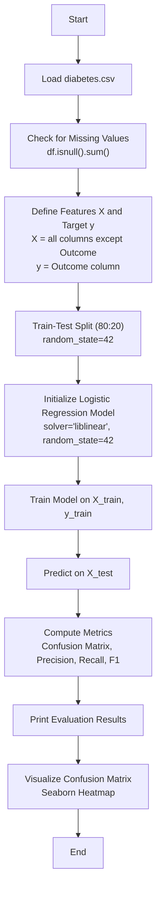

# Assignment 4: Logistic Regression on Pima Indians Diabetes Dataset

## Overview

This assignment implements a binary classification pipeline using **Logistic Regression** to predict whether a patient has diabetes based on diagnostic measurements from the Pima Indians Diabetes Dataset. The model is evaluated using a confusion matrix, precision, recall, and F1-score.

---

## Theory

### Logistic Regression

Logistic Regression is a supervised learning algorithm used for **binary classification** problems. Despite its name, it is a classification algorithm, not a regression algorithm. It models the probability that a given input belongs to a particular class using the **sigmoid (logistic) function**.

**Sigmoid Function:**

$$
\sigma(z) = \frac{1}{1 + e^{-z}}
$$

Where:

* $z = \theta_0 + \theta_1 x_1 + \theta_2 x_2 + \dots + \theta_n x_n$ (which can also be written as $\theta^T x$)

The output of the sigmoid function is a value between 0 and 1, representing the probability of the positive class. A threshold (typically 0.5) is applied to convert probabilities into class labels.

**Decision Boundary:**

- If σ(z) ≥ 0.5 → Predict class 1 (Positive / Diabetes)
- If σ(z) < 0.5 → Predict class 0 (Negative / No Diabetes)

### Cost Function (Log Loss / Binary Cross-Entropy)

$$
J(\theta) = -\frac{1}{m} \sum_{i=1}^{m} \left[ y^{(i)} \log(h_\theta(x^{(i)})) + (1 - y^{(i)}) \log(1 - h_\theta(x^{(i)})) \right]
$$

The model is trained by minimizing this cost function using an optimization algorithm such as **Liblinear** (used in this assignment), which employs coordinate descent.

### Evaluation Metrics

#### Confusion Matrix

A 2×2 table summarizing the predictions:

|                           | Predicted Negative  | Predicted Positive  |
| ------------------------- | ------------------- | ------------------- |
| **Actual Negative** | TN (True Negative)  | FP (False Positive) |
| **Actual Positive** | FN (False Negative) | TP (True Positive)  |

- **True Positive (TP):** Correctly predicted diabetic patients
- **True Negative (TN):** Correctly predicted non-diabetic patients
- **False Positive (FP):** Non-diabetic patients incorrectly predicted as diabetic (Type I error)
- **False Negative (FN):** Diabetic patients incorrectly predicted as non-diabetic (Type II error)

#### Precision

$$
\text{Precision} = \frac{\text{TP}}{\text{TP} + \text{FP}}
$$

Measures the accuracy of positive predictions. High precision means fewer false positives — when the model predicts diabetes, it is usually correct.

#### Recall (Sensitivity / True Positive Rate)

$$
\text{Recall} = \frac{\text{TP}}{\text{TP} + \text{FN}}
$$

Measures the ability of the model to find all positive instances. High recall means fewer false negatives — most diabetic patients are correctly identified.

#### F1-Score

$$
\text{F1} = 2 \times \frac{\text{Precision} \times \text{Recall}}{\text{Precision} + \text{Recall}}
$$

The harmonic mean of precision and recall. It provides a balanced measure, especially useful when class distribution is uneven.

---

## Dataset

### Pima Indians Diabetes Dataset

- **Source:** UCI Machine Learning Repository
- **Task:** Binary classification (Diabetes: Yes/No)
- **Samples:** 768
- **Features:** 8 numerical features
- **Target:** `Outcome` (0 = No Diabetes, 1 = Diabetes)

| Feature                  | Description                                    |
| ------------------------ | ---------------------------------------------- |
| Pregnancies              | Number of times pregnant                       |
| Glucose                  | Plasma glucose concentration (2-hour OGTT)     |
| BloodPressure            | Diastolic blood pressure (mm Hg)               |
| SkinThickness            | Triceps skin fold thickness (mm)               |
| Insulin                  | 2-hour serum insulin (mu U/ml)                 |
| BMI                      | Body mass index (weight in kg / height in m²) |
| DiabetesPedigreeFunction | Diabetes pedigree function                     |
| Age                      | Age in years                                   |
| Outcome                  | Target variable (0 or 1)                       |

---

## How to Run

Open `assignment4.ipynb` in Jupyter Notebook or Google Colab and run all cells sequentially.

### Prerequisites

```bash
pip install pandas scikit-learn matplotlib seaborn
```

### In Google Colab

The notebook uses `google.colab` for drive mounting. Ensure `diabetes.csv` is available in the working directory.

---

## Flowchart



---

## Key Design Decisions

- **Solver `liblinear`:** A coordinate descent solver that is robust for small datasets and supports L1/L2 regularization. Well-suited for binary classification with the Pima dataset size (768 samples).
- **Test size 20%:** A standard split ratio that provides sufficient training data while leaving enough samples for reliable evaluation.
- **random_state=42:** Ensures reproducibility of the train/test split and model initialization.

---

## Output

The notebook produces:

- Printed shapes of X, y, and train/test splits
- First 10 predictions vs actual values
- Confusion matrix (printed as a 2×2 array)
- Precision, Recall, and F1-Score (4 decimal places)
- A color-coded confusion matrix heatmap

---

## 10 Most Likely Questions & Answers

### Q1: Why is Logistic Regression called "regression" if it's a classification algorithm?

**A:** Logistic Regression is a misnomer. It uses a regression-like approach (linear combination of features) but passes the result through a sigmoid function to output a probability between 0 and 1. The probability is then thresholded to make a classification decision.

### Q2: What is the sigmoid function and why is it used?

**A:** The sigmoid function σ(z) = 1/(1 + e⁻ᶻ) maps any real-valued number to the range (0, 1). It is used to convert the linear output of the model into a probability, which can then be interpreted as the likelihood of belonging to the positive class.

### Q3: What is the difference between Precision and Recall?

**A:** Precision measures how many of the predicted positives are actually positive (TP / (TP + FP)). Recall measures how many of the actual positives were correctly identified (TP / (TP + FN)). Precision focuses on prediction quality; recall focuses on capturing all positive instances.

### Q4: When would you prioritize Recall over Precision?

**A:** Recall should be prioritized when the cost of false negatives is high. In the diabetes prediction case, missing a diabetic patient (false negative) is more dangerous than a false alarm (false positive), so high recall is preferred.

### Q5: What does the F1-Score tell us that Precision and Recall alone do not?

**A:** The F1-Score is the harmonic mean of Precision and Recall. It provides a single balanced metric that penalizes extreme imbalances between precision and recall. A model with high precision but low recall (or vice versa) will have a lower F1-Score.

### Q6: Why is `liblinear` chosen as the solver?

**A:** `liblinear` uses coordinate descent and is efficient for small datasets. It supports both L1 and L2 regularization and works well for binary classification. It is a reliable default choice for datasets like the Pima Indians Diabetes dataset with 768 samples.

### Q7: What is the significance of the confusion matrix in binary classification?

**A:** The confusion matrix provides a detailed breakdown of correct and incorrect predictions across both classes. Unlike accuracy alone, it reveals whether the model is making more false positive or false negative errors, which is critical for imbalanced or high-stakes classification tasks.

### Q8: Why is `random_state=42` used in train_test_split?

**A:** Setting `random_state=42` ensures that the data split is deterministic and reproducible. Without it, different runs would produce different splits, leading to varying results. This is essential for consistent experimentation and debugging.

### Q9: What are the limitations of using Logistic Regression for this dataset?

**A:** Logistic Regression assumes a linear decision boundary. If the relationship between features and the target is non-linear, the model may underfit. It also assumes features are roughly independent and does not automatically handle feature interactions or complex patterns.

### Q10: How would you improve the model's performance?

**A:** Potential improvements include: (1) feature engineering or selection to remove irrelevant features, (2) handling missing or zero-valued entries in Glucose/BloodPressure/Insulin which may represent missing data, (3) trying non-linear models like Random Forest or SVM, (4) hyperparameter tuning (e.g., regularization strength C), and (5) using cross-validation for more robust evaluation.
