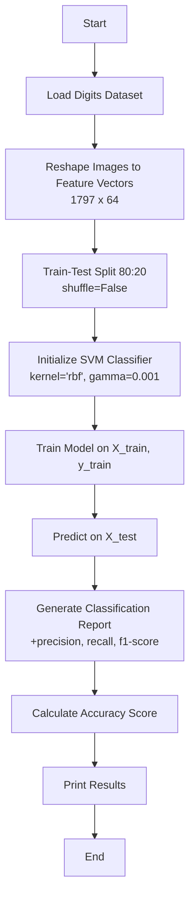

# Assignment 5: Support Vector Machine (SVM) Classification on Digits Dataset

## Overview

This assignment implements a **Support Vector Machine (SVM)** classifier to recognize handwritten digits using the scikit-learn **Digits dataset**. The model uses an **RBF (Radial Basis Function) kernel** and is evaluated using a classification report and accuracy score.

---

## Theory

### Support Vector Machine (SVM)

SVM is a supervised learning algorithm used for both classification and regression. For classification tasks, SVM finds the optimal hyperplane that maximally separates classes by maximizing the **margin** between data points of different classes.

### Kernel Trick

The **kernel trick** allows SVM to operate in a high-dimensional space without explicitly computing the coordinates of the data in that space. The **RBF kernel** (also called Gaussian kernel) maps input features into an infinite-dimensional space, making it powerful for non-linear classification.

**RBF Kernel Function:**

$$K(x_i, x_j) = \exp\left(-\gamma \|x_i - x_j\|^2\right)$$

Where:
- $\gamma$ (gamma) controls the influence of individual training examples. Higher gamma means closer data points have more influence.
- A small gamma creates a smoother decision boundary; a large gamma creates a more complex boundary.

### Hyperparameters

| Parameter | Description |
|---|---|
| `kernel='rbf'` | Uses the Radial Basis Function kernel for non-linear classification |
| `gamma=0.001` | Controls the influence of each training sample — small values create smoother decision boundaries |

### Digits Dataset

- **Source:** Scikit-learn built-in dataset
- **Task:** Multi-class classification (10 digits: 0-9)
- **Samples:** 1797
- **Features:** 64 numerical features (8x8 image pixels, values 0-16)
- **Classes:** 10 (digits 0 through 9)

---

## Flowchart



---

## Analysis Steps

1. **Load Dataset**
   - Load the scikit-learn digits dataset (1797 samples of 8x8 digit images)

2. **Reshape Data**
   - Flatten images from $8 \times 8$ pixels into 64-dimensional feature vectors
   - Shape: `(1797, 64)`

3. **Train-Test Split**
   - Split into training (80%) and testing (20%) sets using `shuffle=False` to preserve order

4. **Model Training**
   - Initialize an SVM classifier with RBF kernel and gamma=0.001
   - Fit the model on the training data

5. **Prediction**
   - Use the trained model to predict digit labels on the test set

6. **Evaluation**
   - Generate a classification report with precision, recall, and F1-score for each class
   - Calculate overall accuracy score

---

## How to Run

```bash
python Code.py
```

Ensure the following files are in the same directory:
- `Code.py`

The script uses the built-in `sklearn.datasets` to load the digits dataset, so no external data files are required.

---

## Expected Output

The script prints:
- A classification report showing precision, recall, and F1-score for each digit class
- An accuracy score as a percentage

Example:
```
Classification report for SVM classifier:
              precision    recall  f1-score   support

           0       1.00      0.99      0.99        36
           1       0.99      1.00      1.00        23
           2       0.99      0.99      0.99        34
           ...
    accuracy                           0.99       357
   macro avg       0.99      0.99      0.99       357
weighted avg       0.99      0.99      0.99       357

Accuracy Score: 98.88%
```

---

## Key Design Decisions

- **RBF Kernel:** The RBF kernel is effective for non-linear classification and works well with image data where pixel features have complex relationships.
- **gamma=0.001:** A small gamma value prevents overfitting by creating smoother decision boundaries, which generalizes better on unseen digit samples.
- **`shuffle=False`:** The test set is taken from the last portion of the dataset, preserving the original ordering. This is useful for examining model behavior on a contiguous subset of data.

---

## 10 Most Likely Questions & Answers

### Q1: What is the difference between linear and RBF kernels in SVM?

**A:** A **linear kernel** creates a linear decision boundary, suitable when classes are linearly separable. The **RBF kernel** creates a non-linear boundary by mapping data into a higher-dimensional space, capturing complex patterns that linear kernels cannot. The digits dataset benefits from the RBF kernel because digit shapes have non-linear relationships between pixels.

### Q2: What does the `gamma` parameter control in the RBF kernel?

**A:** The `gamma` parameter controls how far the influence of a single training example reaches. A **high gamma** means the influence is limited to nearby points, creating complex, wiggly boundaries (risk of overfitting). A **low gamma** means distant points are also considered, creating smoother, simpler boundaries (risk of underfitting).

### Q3: Why is the Digits dataset reshaped before training?

**A:** The original images have shape `(8, 8)` representing a 2D pixel grid. SVM classifiers expect a 2D feature matrix `(n_samples, n_features)`, so each image must be flattened into a 64-element vector. `digits.images.reshape((n_samples, -1))` handles this conversion.

### Q4: What is the "support vector" in SVM?

**A:** Support vectors are the training data points that are closest to the decision boundary (hyperplane). They are the critical elements that define the margin, and the SVM algorithm only uses these points to determine the optimal hyperplane — all other data points are irrelevant once training is complete.

### Q5: Why not use `shuffle=True` for the train-test split?

**A:** Using `shuffle=False` preserves the original order of the dataset. With `shuffle=True`, data is randomized, which is typically preferred to ensure a representative mix. The ordered split here may be intentional for reproducibility or to evaluate model performance on a specific contiguous subset of digits.

### Q6: How is accuracy different from precision and recall in this multi-class setting?

**A:** **Accuracy** measures the overall fraction of correct predictions. **Precision** and **recall** are per-class metrics — precision = TP/(TP+FP), recall = TP/(TP+FN). In the classification report, these are computed for each digit class. The macro/weighted averages aggregate these per-class values into overall scores.

### Q7: What happens if we use a polynomial kernel instead of RBF?

**A:** A polynomial kernel would map data using a polynomial function. It can capture some non-linear relationships but is generally less flexible than the RBF kernel for complex image patterns. The RBF kernel is often a better default for image classification due to its ability to model smooth, localized decision boundaries.

### Q8: How would you handle imbalanced classes in a dataset?

**A:** For imbalanced classes, one can use class weights (`class_weight='balanced'` in sklearn's SVM), apply SMOTE or other oversampling techniques, or use stratified sampling during train-test split to ensure each class is proportionally represented.

### Q9: Can SVM be used for regression?

**A:** Yes — **Support Vector Regression (SVR)** uses the same principle but fits a margin around the regression line (epsilon-tube). It can predict continuous values instead of class labels, making it suitable for regression tasks.

### Q10: What is the time complexity of SVM training?

**A:** SVM training complexity typically ranges between **O(n²)** to **O(n³)** for n training samples, depending on the kernel and dataset. The RBF kernel generally has higher memory and computation costs compared to linear kernels. For large datasets, approximate methods or alternative algorithms may be needed.

---

## Project Structure

```
Assignment5/
├── Code.py           # Main Python script implementing SVM classification
├── README.md         # This documentation file
```

See `requirement.txt` at project root for dependencies.

## Dependencies

- `scikit-learn` — SVM classifier, datasets, metrics
- `pandas` — Data manipulation (used in some output formatting)
- `matplotlib` — (Available for optional visualization)
- `numpy` — Numerical operations