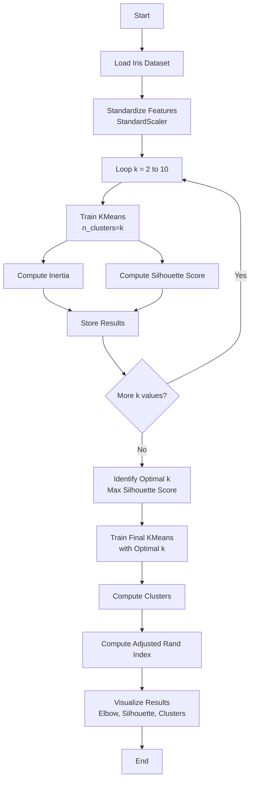

# Assignment 6: K-Means Clustering with Elbow Method on Iris Dataset

## Overview

This assignment implements **K-Means clustering** on the Iris dataset and determines the optimal number of clusters using the **Elbow Method**. The algorithm is evaluated using **Inertia**, **Silhouette Score**, and the **Adjusted Rand Index** to measure cluster quality and alignment with true class labels.

---

## Theory

### K-Means Clustering

K-Means is an **unsupervised** learning algorithm that partitions a dataset into $k$ distinct, non-overlapping clusters. It iteratively assigns data points to the nearest cluster centroid and updates the centroids until convergence.

**Algorithm Steps:**
1. Initialize $k$ centroids (randomly or via K-Means++).
2. Assign each data point to the nearest centroid.
3. Recompute centroids as the mean of all points in each cluster.
4. Repeat steps 2–3 until centroids stabilize or a maximum number of iterations is reached.

**Objective Function:**
$$J = \sum_{i=1}^{k} \sum_{x \in C_i} \|x - \mu_i\|^2$$

Where:
* $C_i$ = set of points in cluster $i$
* $\mu_i$ = centroid of cluster $i$
* $k$ = number of clusters

### Elbow Method

The Elbow Method helps determine the optimal number of clusters by plotting **Inertia** (sum of squared distances of samples to their closest cluster center) against the number of clusters $k$. The "elbow" point — where the rate of decrease sharply changes — indicates the optimal $k$.

**Inertia:**
$$W_k = \sum_{i=1}^{k} \sum_{x \in C_i} \|x - \mu_i\|^2$$

As $k$ increases, inertia decreases because clusters become smaller and tighter. The elbow is the point of diminishing returns.

### Silhouette Score

The Silhouette Score measures how well-separated clusters are. For each sample:
$$s(i) = \frac{b(i) - a(i)}{\max(a(i), b(i))}$$

Where:
* $a(i)$ = mean distance to other points in the same cluster
* $b(i)$ = mean distance to points in the nearest other cluster

The overall score ranges from **-1** (poor clustering) to **+1** (dense, well-separated clusters). Higher values indicate better-defined clusters.

### Adjusted Rand Index (ARI)

ARI measures the similarity between the predicted cluster labels and the true class labels, adjusted for chance. It ranges from **-1** (random labeling) to **+1** (perfect agreement). It is useful when ground-truth labels are available to validate unsupervised clustering results.

---

## Dataset

### Iris Dataset

- **Source:** Scikit-learn built-in dataset (classic open-access dataset)
- **Task:** Unsupervised clustering (3 true species classes)
- **Samples:** 150
- **Features:** 4 numerical features (sepal/petal length and width in cm)
- **Classes:** 3 (Iris-setosa, Iris-versicolor, Iris-virginica)

| Feature             | Description                              |
| ------------------- | ---------------------------------------- |
| sepal length (cm)   | Length of the sepal                      |
| sepal width (cm)    | Width of the sepal                       |
| petal length (cm)   | Length of the petal                      |
| petal width (cm)    | Width of the petal                       |
| target              | Species class (0, 1, 2)                 |

---

## Flowchart



---

## Analysis Steps

1. **Load Dataset**

   - Load the Iris dataset from scikit-learn (150 samples, 4 features, 3 true classes).

2. **Preprocess Data**

   - Standardize features using `StandardScaler` to ensure all features contribute equally to distance calculations.

3. **Elbow Method Experimentation**

   - Train K-Means for $k = 2$ to $10$.
   - Record **Inertia** and **Silhouette Score** for each $k$.
   - Plot both metrics to identify the optimal number of clusters.

4. **Final Clustering**

   - Train K-Means with the optimal $k$ (selected by highest Silhouette Score).
   - Compute cluster assignments for all samples.

5. **Evaluation**

   - Calculate **Adjusted Rand Index** to compare predicted clusters against true species labels.
   - Visualize the elbow curve, silhouette scores, and final cluster scatter plot.

---

## How to Run

```bash
python Code.py
```

Ensure the following files are in the same directory:
- `Code.py`
- `elbow_and_clusters.png` (generated output)

---

## Key Design Decisions

- **StandardScaler:** K-Means uses Euclidean distance, which is scale-sensitive. Standardization ensures all four features (measured in cm) contribute equally.
- **`n_init=10`:** Runs K-Means with 10 different centroid seeds to avoid poor local optima.
- **`random_state=42`:** Ensures reproducible cluster assignments across runs.
- **Silhouette over Elbow alone:** The elbow can be ambiguous; combining it with Silhouette Score provides a more robust selection of $k$.
- **ARI for validation:** Since the Iris dataset has true labels, ARI quantifies how well the unsupervised clusters match the actual species.

---

## Expected Output

The script prints:

- Optimal number of clusters (by Silhouette Score)
- Inertia and Silhouette Score at the optimal $k$
- Adjusted Rand Index (vs true labels)
- A saved figure `elbow_and_clusters.png` containing:
  - Elbow curve (Inertia vs $k$)
  - Silhouette Score curve (vs $k$)
  - 2D cluster scatter plot with centroids (for $k=2$ or $k=3$)

Example:
```
Optimal number of clusters (by Silhouette Score): 2
Inertia at k=2: 222.36
Silhouette Score at k=2: 0.5818
Adjusted Rand Index (vs true labels): 0.5681
Plot saved as elbow_and_clusters.png
```

---

## 10 Most Likely Questions & Answers

### Q1: What is K-Means clustering and when is it used?

**A:** K-Means is an unsupervised algorithm that groups data into $k$ clusters by minimizing within-cluster variance. It is used when you have unlabeled data and want to discover hidden groupings or patterns.

### Q2: Why is feature standardization important for K-Means?

**A:** K-Means uses Euclidean distance, which is dominated by features with larger scales. Standardizing ensures all features contribute equally. For example, petal length (1–6 cm) and sepal width (2–4.5 cm) would otherwise unevenly influence cluster boundaries.

### Q3: What is the Elbow Method and how do you interpret the elbow point?

**A:** The Elbow Method plots Inertia vs $k$. As $k$ increases, inertia decreases. The elbow is the $k$ after which inertia decreases linearly — adding more clusters yields diminishing returns.

### Q4: What is the Silhouette Score and why is it useful?

**A:** The Silhouette Score measures cluster cohesion and separation. Values near +1 indicate well-separated clusters; values near 0 indicate overlapping clusters. It is more reliable than the elbow for ambiguous datasets.

### Q5: Why does the code use Silhouette Score instead of only the Elbow Method?

**A:** The elbow can be subjective. Silhouette Score provides an objective, quantitative metric. In this assignment, the optimal $k$ is selected as the one with the highest Silhouette Score.

### Q6: What is Inertia in K-Means?

**A:** Inertia is the sum of squared distances from each point to its assigned cluster centroid. Lower inertia means tighter clusters. However, inertia always decreases as $k$ increases, so it cannot be used alone to pick $k$.

### Q7: What does the Adjusted Rand Index tell us?

**A:** ARI compares the predicted cluster labels to ground-truth labels, adjusted for chance. A value of 0.5681 means the clustering moderately agrees with the true Iris species. ARI is useful only when true labels exist.

### Q8: Why is `n_init=10` used in KMeans?

**A:** K-Means can converge to poor local minima depending on centroid initialization. `n_init=10` runs the algorithm 10 times with different seeds and returns the best result (lowest inertia).

### Q9: What are the limitations of K-Means?

**A:**
- Requires $k$ to be specified in advance.
- Assumes spherical, equally sized clusters.
- Sensitive to outliers.
- Sensitive to initial centroid placement (mitigated by `n_init` and K-Means++).
- Struggles with non-convex cluster shapes.

### Q10: How would you improve clustering results for this dataset?

**A:**
- Try different preprocessing (e.g., PCA before clustering).
- Use DBSCAN or Gaussian Mixture Models for non-spherical clusters.
- Perform feature engineering (e.g., petal area = petal length × petal width).
- Use hierarchical clustering to visualize dendrograms and validate $k$.

---

## Project Structure

```
Assignment6/
├── Code.py               # Main Python script implementing K-Means with Elbow Method
├── elbow_and_clusters.png # Generated visualization (Elbow, Silhouette, Clusters)
└── README.md             # This documentation file
```

See `requirement.txt` at project root for dependencies.

---

## Dependencies

- `scikit-learn` — KMeans, datasets, preprocessing, metrics
- `numpy` — Numerical operations
- `matplotlib` — Plotting and visualization
- `pandas` — Data handling (used for structure consistency)

See `requirement.txt` at the project root for the complete list of dependencies.
