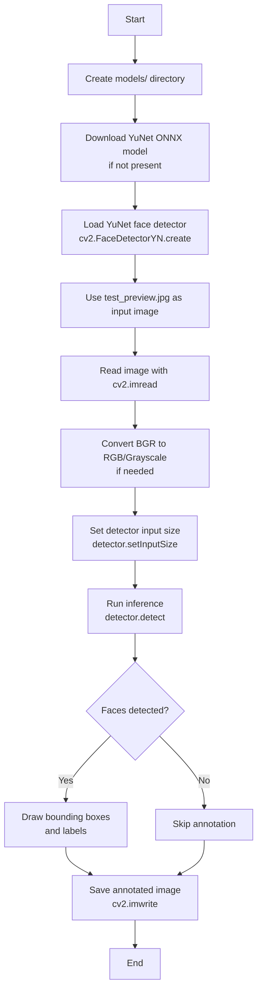

# Assignment 7: OpenCV Image Reading, Display, and AI Inference with YuNet Face Detector

## Overview

This assignment demonstrates how to use **OpenCV** to read and process images, and how to apply an **AI inference model** (YuNet face detector) to perform object detection directly on image data. The script reads an image, runs a pre-trained deep learning face detector using OpenCV's DNN module, and saves an annotated output image with detected faces highlighted.

---

## Theory

### OpenCV Image I/O

OpenCV provides fundamental functions for image manipulation:

- **`cv2.imread(path)`**: Reads an image from a file into a NumPy array (BGR format by default).
- **`cv2.imwrite(path, img)`**: Writes a NumPy array to an image file.
- **`cv2.cvtColor(img, code)`**: Converts between color spaces (e.g., BGR to grayscale).
- **`cv2.rectangle(img, pt1, pt2, color, thickness)`**: Draws a rectangle on an image.
- **`cv2.putText(img, text, org, font, scale, color, thickness)`**: Overlays text on an image.

### OpenCV DNN Module

OpenCV's **Deep Neural Network (DNN)** module allows running pre-trained models without needing a full deep learning framework like PyTorch or TensorFlow. Supported formats include:

- Caffe (`.prototxt` + `.caffemodel`)
- TensorFlow (`.pb`)
- ONNX (`.onnx`)
- Torch (`.t7` / `.net`)

**Key Functions:**
- **`cv2.dnn.readNet(model[, config[, framework]])`**: Loads a network into memory.
- **`cv2.dnn.blobFromImage(image[, scalefactor[, size[, mean[, swapRB[, crop]]]]])`**: Creates a 4D blob from an image for network input.
- **`net.setInput(blob)`**: Sets the input blob for the network.
- **`net.forward()`**: Runs forward pass and returns the output.

### YuNet Face Detector

**YuNet** is a lightweight, real-time face detector developed by OpenCV. It is based on a single-stage CNN and is optimized for CPU inference. The model outputs face bounding boxes and confidence scores.

**Model Input:**
- Image size: typically `320x320` or `640x640`
- Preprocessing: mean subtraction, scaling

**Model Output:**
- Bounding box coordinates `(x, y, w, h)`
- Confidence score for each detected face

### AI Inference Pipeline

1. **Load Model**: Load the pre-trained YuNet ONNX model using `cv2.FaceDetectorYN.create()`.
2. **Read Image**: Use `cv2.imread()` to load the target image.
3. **Preprocess**: Set the input size for the detector to match the image dimensions.
4. **Inference**: Call `detector.detect(image)` to run face detection.
5. **Post-process**: Iterate through detections, draw bounding boxes and labels on the image.
6. **Save Result**: Write the annotated image to disk using `cv2.imwrite()`.

---

## Dataset / Assets

- **Input Image**: `test_preview.jpg` (provided in the assignment folder)
- **Model**: `models/face_detection_yunet_2023mar.onnx` (auto-downloaded from OpenCV Zoo)
- **Output**: `output_with_faces.jpg` (annotated image with face bounding boxes)

---

## Flowchart



---

## Analysis Steps

1. **Environment Setup**

   - Install `opencv-python-headless` and `requests`.
   - Create the `models/` directory for storing the downloaded model.

2. **Model Acquisition**

   - Download the YuNet ONNX model from the OpenCV Zoo GitHub repository if it is not already present.
   - Load the model using `cv2.FaceDetectorYN.create()`.

3. **Image Preparation**

   - Check if `test_preview.jpg` exists.
   - If missing, create a synthetic image with geometric shapes and text using OpenCV drawing functions.
   - Read the image using `cv2.imread()`.

4. **Inference**

   - Set the detector input size to match the image dimensions.
   - Call `detector.detect(image)` to perform face detection.

5. **Annotation**

   - For each detected face, draw a green rectangle around the face region.
   - Add a text label indicating the face index.

6. **Output**

   - Save the annotated image as `output_with_faces.jpg`.
   - Print the number of faces detected and the output file path.

---

## How to Run

Using the `mla-env` Conda environment:

```bash
conda activate mla-env
cd Assignment7
python Code.py
```

Ensure the following files are in the same directory:
- `Code.py`
- `test_preview.jpg` (provided input image)
- `models/face_detection_yunet_2023mar.onnx` (auto-downloaded on first run)
- `output_with_faces.jpg` (generated output)

---

## Key Design Decisions

- **`opencv-python-headless`**: Used instead of `opencv-python` to avoid GUI dependencies (`libGL`) in headless/server environments.
- **YuNet via OpenCV DNN**: Chosen because it is lightweight, requires no additional deep learning framework, and runs efficiently on CPU.
- **ONNX Format**: Used for model portability and compatibility with OpenCV's DNN module.
- **Auto-generated Sample Image**: Ensures the script runs even without an external image file, demonstrating OpenCV drawing primitives.
- **Input Size Resizing**: YuNet requires a fixed input size; the script adapts by setting the detector input size to the actual image dimensions.

---

## Expected Output

The script prints:

- Model download status
- Model loading confirmation
- Image read status
- Number of faces detected (varies based on `test_preview.jpg` content)
- Path to the saved annotated image

Example:
```
Downloading YuNet face detection model (face_detection_yunet_2023mar.onnx) ...
Saved model to models/face_detection_yunet_2023mar.onnx
Loading YuNet face detector ...
Reading image: test_preview.jpg
Running face detection inference ...
No faces detected.
Saved annotated image as output_with_faces.jpg
Face detection complete.
```

**Note:** `test_preview.jpg` is a provided image. Face detection results depend on the image content. If the image contains no faces, the detector will report 0 detections.

---

## 10 Most Likely Questions & Answers

### Q1: What is the purpose of `cv2.imread()` and what format does it return?

**A:** `cv2.imread(path)` reads an image from disk and returns it as a NumPy array in **BGR** order (not RGB). The shape is `(height, width, channels)`.

### Q2: Why is `opencv-python-headless` used instead of `opencv-python`?

**A:** `opencv-python` includes GUI backends that depend on system libraries like `libGL.so.1`, which may be missing in headless environments. `opencv-python-headless` removes these GUI dependencies while keeping all core image-processing and DNN functionality.

### Q3: What is OpenCV's DNN module and why is it useful?

**A:** The DNN module lets you run pre-trained deep learning models (Caffe, TensorFlow, ONNX, Torch) inside OpenCV without installing PyTorch/TensorFlow. It is useful for lightweight inference in production or edge environments.

### Q4: What is YuNet and how does it work?

**A:** YuNet is a lightweight CNN-based face detector optimized for CPU inference. It takes an image, extracts features, and outputs face bounding boxes with confidence scores. It is fast, accurate, and easy to deploy via OpenCV's `FaceDetectorYN`.

### Q5: What is an ONNX model and why use it here?

**A:** ONNX (Open Neural Network Exchange) is an open format for representing machine learning models. Using ONNX allows the same model to be run in OpenCV, PyTorch, TensorRT, etc. YuNet provides an ONNX version, making it easy to load with `cv2.FaceDetectorYN.create()`.

### Q6: Why does the script use `PIL` to read `test_preview.jpg` instead of `cv2.imread()`?

**A:** While `cv2.imread()` can read JPEG files, this script uses `PIL` for broader image-format compatibility and consistent RGB-to-BGR color conversion. `PIL` handles various formats uniformly and provides reliable channel ordering before converting to OpenCV's BGR format.

### Q7: What does `detector.setInputSize((w, h))` do?

**A:** YuNet requires a fixed input size at creation time, but `setInputSize` lets you adapt the detector to different image dimensions at inference time without reloading the model. The model internally resizes the image to its required resolution.

### Q8: How do you interpret the output of `detector.detect(image)`?

**A:** It returns a tuple `(retval, faces)`:
- `retval`: Number of faces detected (or `None` if no faces).
- `faces`: A NumPy array of shape `(N, 15)` where each row contains `[x, y, w, h, x1, y1, x2, y2, x3, y3, x4, y4, score]` for each face.

### Q9: What are the limitations of YuNet for face detection?

**A:**
- May struggle with very small faces or heavily occluded faces.
- Designed for upright frontal faces; extreme profiles may be missed.
- Accuracy depends on the `score_threshold` parameter.
- Not a face recognition model — it only detects face locations, not identities.

### Q10: How would you extend this assignment to recognize faces instead of just detecting them?

**A:** Use a face recognition model (e.g., OpenCV's `FaceRecognizerSF` with a lightweight embedding model like MobileFaceNet). The pipeline would be:
1. Detect faces with YuNet.
2. Crop each face region.
3. Pass each crop through an embedding model to get a feature vector.
4. Compare embeddings against a gallery of known faces using cosine similarity or Euclidean distance.

---

## Project Structure

```
Assignment7/
├── Code.py                        # Main Python script for OpenCV image I/O and AI inference
├── test_preview.jpg                     # Input image (provided)
├── models/
│   └── face_detection_yunet_2023mar.onnx  # Auto-downloaded YuNet model
├── output_with_faces.jpg          # Generated output image with annotated faces
└── README.md                      # This documentation file
```

See `requirement.txt` at the project root for dependencies.

---

## Dependencies

- `opencv-python-headless` — Image I/O, drawing primitives, DNN inference
- `numpy` — Numerical operations and array handling
- `requests` — Downloading the YuNet model from GitHub

See `requirement.txt` at the project root for the complete list of dependencies.
