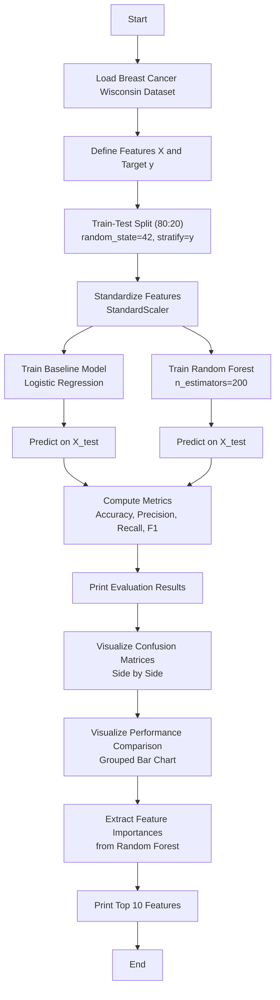

# Assignment 8: Random Forest Classifier vs Baseline Model on Breast Cancer Wisconsin Dataset

## Overview

This assignment implements a binary classification pipeline comparing a **Random Forest Classifier** against a baseline **Logistic Regression** model on the Breast Cancer Wisconsin Dataset. Performance is monitored using accuracy, precision, recall, F1-score, confusion matrices, and feature importance analysis.

---

## Theory

### Baseline Model: Logistic Regression

Logistic Regression is a supervised learning algorithm used for **binary classification** problems. Despite its name, it is a classification algorithm, not a regression algorithm. It models the probability that a given input belongs to a particular class using the **sigmoid (logistic) function**.

**Sigmoid Function:**

$$
\sigma(z) = \frac{1}{1 + e^{-z}}
$$

Where:

* $z = \theta_0 + \theta_1 x_1 + \theta_2 x_2 + \dots + \theta_n x_n$ (which can also be written as $\theta^T x$)

The output of the sigmoid function is a value between 0 and 1, representing the probability of the positive class. A threshold (typically 0.5) is applied to convert probabilities into class labels.

**Decision Boundary:**

- If σ(z) ≥ 0.5 → Predict class 1 (Positive / Malignant)
- If σ(z) < 0.5 → Predict class 0 (Negative / Benign)

**Cost Function (Log Loss / Binary Cross-Entropy):**

$$
J(\theta) = -\frac{1}{m} \sum_{i=1}^{m} \left[ y^{(i)} \log(h_\theta(x^{(i)})) + (1 - y^{(i)}) \log(1 - h_\theta(x^{(i)})) \right]
$$

The model is trained by minimizing this cost function using an optimization algorithm such as **LBFGS** (used in this assignment).

### Random Forest Classifier

Random Forest is an **ensemble** learning method that constructs multiple decision trees during training and outputs the class that is the mode of the classes predicted by individual trees.

**Key Concepts:**

1. **Bagging (Bootstrap Aggregating):** Each tree is trained on a random subset of the training data (with replacement). This reduces variance and prevents overfitting.
2. **Feature Randomness:** At each split, a random subset of features is considered, further decorrelating the trees.
3. **Majority Voting:** The final prediction is determined by majority vote across all trees.

**Advantages over a single Decision Tree:**

- Reduces overfitting by averaging multiple trees
- Handles non-linear relationships and feature interactions
- Provides feature importance scores
- Robust to outliers and noisy data

**Comparison with Logistic Regression:**

| Aspect | Logistic Regression | Random Forest |
| --- | --- | --- |
| **Model Type** | Linear | Non-linear ensemble |
| **Decision Boundary** | Linear | Complex, non-linear |
| **Feature Interactions** | No | Yes |
| **Interpretability** | High (coefficients) | Medium (feature importance) |
| **Overfitting Risk** | Low | Medium (mitigated by ensemble) |
| **Training Speed** | Fast | Slower (multiple trees) |

### Evaluation Metrics

#### Confusion Matrix

A 2×2 table summarizing the predictions:

| | Predicted Negative | Predicted Positive |
| --- | --- | --- |
| **Actual Negative** | TN (True Negative) | FP (False Positive) |
| **Actual Positive** | FN (False Negative) | TP (True Positive) |

- **True Positive (TP):** Correctly predicted malignant cases
- **True Negative (TN):** Correctly predicted benign cases
- **False Positive (FP):** Benign cases incorrectly predicted as malignant (Type I error)
- **False Negative (FN):** Malignant cases incorrectly predicted as benign (Type II error)

#### Precision

$$
\text{Precision} = \frac{\text{TP}}{\text{TP} + \text{FP}}
$$

Measures the accuracy of positive predictions. High precision means fewer false positives.

#### Recall (Sensitivity / True Positive Rate)

$$
\text{Recall} = \frac{\text{TP}}{\text{TP} + \text{FN}}
$$

Measures the ability of the model to find all positive instances. High recall means fewer false negatives.

#### F1-Score

$$
\text{F1} = 2 \times \frac{\text{Precision} \times \text{Recall}}{\text{Precision} + \text{Recall}}
$$

The harmonic mean of precision and recall. It provides a balanced measure.

---

## Dataset

### Breast Cancer Wisconsin Dataset

- **Source:** Scikit-learn built-in dataset (UCI Machine Learning Repository)
- **Task:** Binary classification (Malignant / Benign)
- **Samples:** 569
- **Features:** 30 numerical features (mean, standard error, and worst of cell nuclei characteristics)
- **Target:** `target` (0 = Malignant, 1 = Benign)

| Feature Group | Example Features |
| --- | --- |
| Mean | `mean radius`, `mean texture`, `mean perimeter`, `mean area` |
| Standard Error | `radius error`, `texture error`, `perimeter error` |
| Worst | `worst radius`, `worst texture`, `worst perimeter`, `worst area` |

---

## How to Run

```bash
python Code.py
```

Ensure the following files are in the same directory:
- `Code.py`
- `comparison_confusion_matrix.png` (generated output)
- `performance_comparison.png` (generated output)

---

## Flowchart



---

## Analysis Steps

1. **Load Dataset**

   - Load the Breast Cancer Wisconsin dataset from scikit-learn (569 samples, 30 features, binary target).

2. **Preprocess Data**

   - Split into training (80%) and testing (20%) sets using `stratify=y` to preserve class balance.
   - Standardize features using `StandardScaler` for Logistic Regression (scale-sensitive).

3. **Baseline Model Training**

   - Train a Logistic Regression model on the scaled training data.
   - Evaluate on the test set using accuracy, precision, recall, and F1-score.

4. **Random Forest Training**

   - Train a Random Forest Classifier with `n_estimators=200` on the original (unscaled) training data.
   - Evaluate on the test set using the same metrics.

5. **Visualization and Comparison**

   - Plot confusion matrices for both models side by side.
   - Plot a grouped bar chart comparing accuracy, precision, recall, and F1-score.
   - Extract and print the top 10 feature importances from the Random Forest.

---

## Key Design Decisions

- **Baseline Model: Logistic Regression** — Chosen as a simple, interpretable linear baseline for comparison. Assignment 4 uses the same dataset with Logistic Regression, making this a natural extension.
- **Test Size 20%** — Standard split that provides sufficient training data while leaving enough samples for reliable evaluation.
- **`stratify=y`** — Preserves the class distribution in train and test splits, important for imbalanced medical datasets.
- **`random_state=42`** — Ensures reproducibility of the train/test split and model initialization.
- **Feature Scaling Only for Logistic Regression** — Random Forest is tree-based and scale-invariant, so scaling is not required for it.
- **`n_estimators=200`** — Provides a robust ensemble while keeping training time reasonable.

---

## Output

The script produces:

- Printed performance metrics (accuracy, precision, recall, F1-score) for both models
- `comparison_confusion_matrix.png` — Side-by-side confusion matrices for Logistic Regression and Random Forest
- `performance_comparison.png` — Grouped bar chart comparing the four metrics
- Top 10 feature importances from the Random Forest model (printed to console)

Example:
```
Baseline (Logistic Regression) Performance:
  Accuracy : 0.9825
  Precision: 0.9861
  Recall   : 0.9861
  F1-Score : 0.9861

Random Forest Classifier Performance:
  Accuracy : 0.9561
  Precision: 0.9589
  Recall   : 0.9722
  F1-Score : 0.9655
```

---

## 10 Most Likely Questions & Answers

### Q1: Why choose Logistic Regression as the baseline model?

**A:** Logistic Regression is a simple, fast, and interpretable linear model. It provides a performance benchmark against which the more complex Random Forest can be compared. If Random Forest does not significantly outperform Logistic Regression, the simpler model is preferred (Occam's razor).

### Q2: What is the main difference between Logistic Regression and Random Forest?

**A:** Logistic Regression is a linear model that assumes a linear decision boundary. Random Forest is a non-linear ensemble of decision trees that can capture complex interactions between features. Random Forest is more flexible but less interpretable.

### Q3: Why is feature scaling applied only to Logistic Regression and not to Random Forest?

**A:** Logistic Regression is sensitive to feature scales because it uses gradient-based optimization. Random Forest is tree-based and relies on feature thresholds for splitting, making it invariant to feature scaling.

### Q4: What does `stratify=y` do in `train_test_split` and why is it important?

**A:** `stratify=y` ensures that the class distribution in the train and test sets matches the original dataset. This is important for imbalanced datasets to avoid evaluating the model on a test set with a skewed class distribution.

### Q5: What is ensemble learning and how does Random Forest implement it?

**A:** Ensemble learning combines multiple base models to produce a better predictive model. Random Forest uses bagging: it trains multiple decision trees on different bootstrap samples of the data and aggregates their predictions via majority voting.

### Q6: What are feature importances in Random Forest and how are they calculated?

**A:** Feature importance measures the contribution of each feature to the model's predictions. In Random Forest, it is calculated as the total reduction in impurity (e.g., Gini impurity) brought by that feature across all trees, averaged over all trees.

### Q7: Why might Random Forest underperform Logistic Regression on some datasets?

**A:** If the data is linearly separable or the relationship between features and target is approximately linear, a simple model like Logistic Regression may perform as well or better. Random Forest may also overfit if `n_estimators` is too high or the trees are too deep.

### Q8: What is the trade-off between precision and recall in medical diagnosis?

**A:** In medical diagnosis, high recall is often prioritized to minimize false negatives (missed diagnoses). However, high recall may come at the cost of lower precision (more false positives). The optimal balance depends on the clinical context and the cost of each type of error.

### Q9: How does `n_estimators` affect Random Forest performance?

**A:** Increasing `n_estimators` generally improves performance and reduces variance, but with diminishing returns. Too many trees increase training time and memory usage without significant gains. Typical values range from 100 to 500.

### Q10: What other ensemble methods could be used instead of Random Forest?

**A:** Other ensemble methods include:
- **Gradient Boosting (e.g., XGBoost, LightGBM):** Builds trees sequentially, correcting errors from previous trees. Often achieves higher accuracy but is more prone to overfitting.
- **AdaBoost:** Combines weak learners sequentially, focusing on misclassified samples.
- **Voting Classifier:** Combines predictions from multiple different models (e.g., Logistic Regression + SVM + Random Forest).

---

## Project Structure

```
Assignment8/
├── Code.py                        # Main Python script comparing Random Forest and Logistic Regression
├── comparison_confusion_matrix.png # Side-by-side confusion matrices
├── performance_comparison.png      # Grouped bar chart of metrics
└── README.md                       # This documentation file
```

See `requirement.txt` at project root for dependencies.

---

## Dependencies

- `scikit-learn` — Datasets, Logistic Regression, Random Forest, metrics
- `pandas` — Data handling
- `numpy` — Numerical operations
- `matplotlib` — Plotting and visualization

See `requirement.txt` at the project root for the complete list of dependencies.
